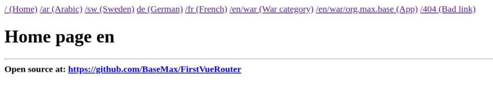

# First Vue-Router

Sample web page using **vuejs + vue-router** just for fun.

Good example for starter and learning **Vue Js** easily and fastly. (Just in 10 minutes)

[](https://github.com/BaseMax/FirstVueRouter/blob/master/asset/script.js)

### VueRouter

One example:

```
const routes = [
  { path: '/:lang?', component: HomePage },
  { path: '/:lang/search', component: SearchPage },
  { path: '/:lang/:cat', component: CategoryPage },
  { path: '/:lang/:cat/:app', component: ApplicationPage },
  { path: '/:lang/*', component: NotFoundComponent },
  { path: '*', component: NotFoundComponent }
]
```

**The following url will be identified:**

- `/`
- `/en/`
- `/ar/`
- `/de/`
- `/fr/`
- `/en/category_name/`
- `/ar/sample_name-testing/`
- `/en/war/name_of_application_or-game/`
- `/en/search/`
- `/dfg/dfg/dfg/dfg/dfg/dfg/df/gd/fgdf/g`
- Others will be 404 error...

https://github.com/BaseMax/FirstVueRouter/blob/master/asset/script.js

### Run and serve

#### Run using NodeJs

```
$ node serve.js
```

And open `http://localhost:8282/` in the Browser.

#### Run using Nginx

```
location / {
  try_files $uri $uri/ /index.html;
}
```

#### Run using Apache

```
<IfModule mod_rewrite.c>
  RewriteEngine On
  RewriteBase /
  RewriteRule ^index\.html$ - [L]
  RewriteCond %{REQUEST_FILENAME} !-f
  RewriteCond %{REQUEST_FILENAME} !-d
  RewriteRule . /index.html [L]
</IfModule>
```

Read more: https://router.vuejs.org/guide/essentials/history-mode.html#example-server-configurations

### CDN for VueJS

**VueJs:**

- https://cdnjs.com/libraries/vue
- https://www.jsdelivr.com/package/npm/vue

**Vue-Router:**

- https://cdnjs.com/libraries/vue-router
- https://www.jsdelivr.com/package/npm/vue-router

Read more: https://router.vuejs.org/installation.html

### Why Vue Router HTML5 History Mode?

**HTML5 History Mode**

```
const router = new VueRouter({
  mode: 'history',
  routes: routes,
})
```

Read more:

- https://forum.vuejs.org/t/why-vue-router-html5-history-mode/82767/3
- https://router.vuejs.org/guide/essentials/history-mode.html

### Related Repositories

https://github.com/BaseMax/FirstVuejs

---------

# Max Base

My nickname is Max, Programming language developer, Full-stack programmer. I love computer scientists, researchers, and compilers. ([Max Base](https://maxbase.org/))

<a target="_blank" href="https://www.paypal.com/donate/?cmd=_donations&business=maxbasecode@gmail.com&currency_code=USD&source=url&item_name=Donate:+Supporting+my+open+source+activities+GitHub.com/basemax&item_number=GitHub,+Inc">

</a>
